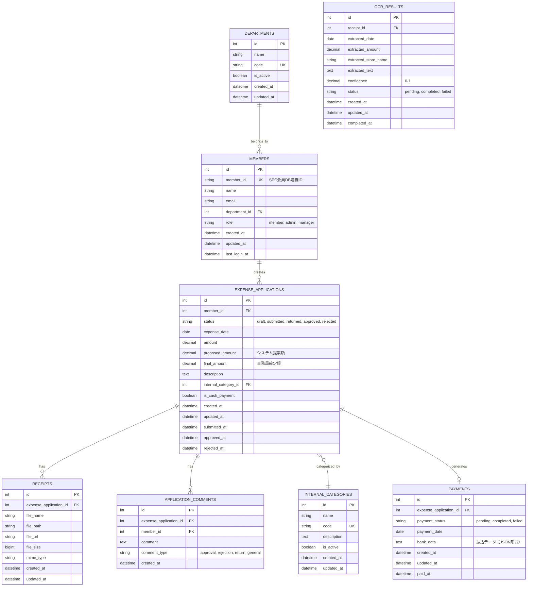

# SPC 経費精算システム データベーススキーマ定義書

## 1. 概要

本ドキュメントは、SPC経費精算システムMVPのデータベーススキーマを定義します。

---

## 2. ER図

---

## 3. テーブル定義

### 3.1 members（会員）

会員情報を管理するテーブル。SPC会員DBと連携。

| カラム名 | 型 | 制約 | 説明 |
|---------|-----|------|------|
| id | INTEGER | PRIMARY KEY, AUTO_INCREMENT | 会員ID（内部ID） |
| member_id | VARCHAR(50) | UNIQUE, NOT NULL | SPC会員DB連携ID |
| name | VARCHAR(100) | NOT NULL | 氏名 |
| email | VARCHAR(255) | UNIQUE, NOT NULL | メールアドレス |
| department_id | INTEGER | FOREIGN KEY, NOT NULL | 部門ID |
| role | VARCHAR(20) | NOT NULL, DEFAULT 'member' | ロール（member, admin, manager） |
| created_at | TIMESTAMP | NOT NULL, DEFAULT CURRENT_TIMESTAMP | 作成日時 |
| updated_at | TIMESTAMP | NOT NULL, DEFAULT CURRENT_TIMESTAMP ON UPDATE CURRENT_TIMESTAMP | 更新日時 |
| last_login_at | TIMESTAMP | NULL | 最終ログイン日時 |

**インデックス**:
- PRIMARY KEY (id)
- UNIQUE KEY (member_id)
- UNIQUE KEY (email)
- INDEX (department_id)
- INDEX (role)

**外部キー**:
- department_id → departments(id)

---

### 3.2 departments（部門）

部門マスタ。SPC会員DBと連携。

| カラム名 | 型 | 制約 | 説明 |
|---------|-----|------|------|
| id | INTEGER | PRIMARY KEY, AUTO_INCREMENT | 部門ID |
| name | VARCHAR(100) | NOT NULL | 部門名 |
| code | VARCHAR(20) | UNIQUE, NOT NULL | 部門コード |
| is_active | BOOLEAN | NOT NULL, DEFAULT TRUE | 有効フラグ |
| created_at | TIMESTAMP | NOT NULL, DEFAULT CURRENT_TIMESTAMP | 作成日時 |
| updated_at | TIMESTAMP | NOT NULL, DEFAULT CURRENT_TIMESTAMP ON UPDATE CURRENT_TIMESTAMP | 更新日時 |

**インデックス**:
- PRIMARY KEY (id)
- UNIQUE KEY (code)
- INDEX (is_active)

---

### 3.3 expense_applications（経費申請）

経費申請情報を管理するテーブル。

| カラム名 | 型 | 制約 | 説明 |
|---------|-----|------|------|
| id | INTEGER | PRIMARY KEY, AUTO_INCREMENT | 申請ID |
| member_id | INTEGER | FOREIGN KEY, NOT NULL | 申請者（会員ID） |
| status | VARCHAR(20) | NOT NULL, DEFAULT 'draft' | ステータス（draft, submitted, returned, approved, rejected） |
| expense_date | DATE | NOT NULL | 経費発生日 |
| amount | DECIMAL(10,2) | NOT NULL | 申請金額 |
| proposed_amount | DECIMAL(10,2) | NULL | システム提案補助金額 |
| final_amount | DECIMAL(10,2) | NULL | 事務局確定補助金額 |
| description | TEXT | NOT NULL | 申請内容説明 |
| internal_category_id | INTEGER | FOREIGN KEY, NULL | 社内カテゴリID |
| is_cash_payment | BOOLEAN | NOT NULL, DEFAULT FALSE | 現金対応フラグ |
| created_at | TIMESTAMP | NOT NULL, DEFAULT CURRENT_TIMESTAMP | 作成日時 |
| updated_at | TIMESTAMP | NOT NULL, DEFAULT CURRENT_TIMESTAMP ON UPDATE CURRENT_TIMESTAMP | 更新日時 |
| submitted_at | TIMESTAMP | NULL | 申請送信日時 |
| approved_at | TIMESTAMP | NULL | 承認日時 |
| rejected_at | TIMESTAMP | NULL | 却下日時 |

**インデックス**:
- PRIMARY KEY (id)
- INDEX (member_id)
- INDEX (status)
- INDEX (expense_date)
- INDEX (internal_category_id)
- INDEX (submitted_at)
- INDEX (approved_at)
- INDEX (status, expense_date) -- 複合インデックス（検索用）

**外部キー**:
- member_id → members(id)
- internal_category_id → internal_categories(id)

**ステータス遷移**:
- draft → submitted → returned / approved / rejected
- returned → submitted（再申請可能）

---

### 3.4 receipts（領収書）

領収書画像を管理するテーブル。

| カラム名 | 型 | 制約 | 説明 |
|---------|-----|------|------|
| id | INTEGER | PRIMARY KEY, AUTO_INCREMENT | 領収書ID |
| expense_application_id | INTEGER | FOREIGN KEY, NOT NULL | 申請ID |
| file_name | VARCHAR(255) | NOT NULL | ファイル名 |
| file_path | VARCHAR(500) | NOT NULL | ファイルパス（ストレージ内） |
| file_url | VARCHAR(500) | NOT NULL | ファイルURL（アクセス用） |
| file_size | BIGINT | NOT NULL | ファイルサイズ（バイト） |
| mime_type | VARCHAR(100) | NOT NULL | MIMEタイプ |
| created_at | TIMESTAMP | NOT NULL, DEFAULT CURRENT_TIMESTAMP | 作成日時 |
| updated_at | TIMESTAMP | NOT NULL, DEFAULT CURRENT_TIMESTAMP ON UPDATE CURRENT_TIMESTAMP | 更新日時 |

**インデックス**:
- PRIMARY KEY (id)
- INDEX (expense_application_id)

**外部キー**:
- expense_application_id → expense_applications(id) ON DELETE CASCADE

**制約**:
- 1つの申請に複数の領収書を紐付け可能

---

### 3.5 ocr_results（OCR結果）

OCR抽出結果を管理するテーブル。

| カラム名 | 型 | 制約 | 説明 |
|---------|-----|------|------|
| id | INTEGER | PRIMARY KEY, AUTO_INCREMENT | OCR結果ID |
| receipt_id | INTEGER | FOREIGN KEY, UNIQUE, NOT NULL | 領収書ID |
| extracted_date | DATE | NULL | 抽出された日付 |
| extracted_amount | DECIMAL(10,2) | NULL | 抽出された金額 |
| extracted_store_name | VARCHAR(255) | NULL | 抽出された店舗名 |
| extracted_text | TEXT | NULL | 抽出された全文 |
| confidence | DECIMAL(3,2) | NULL | 信頼度スコア（0.00-1.00） |
| status | VARCHAR(20) | NOT NULL, DEFAULT 'pending' | ステータス（pending, completed, failed） |
| created_at | TIMESTAMP | NOT NULL, DEFAULT CURRENT_TIMESTAMP | 作成日時 |
| updated_at | TIMESTAMP | NOT NULL, DEFAULT CURRENT_TIMESTAMP ON UPDATE CURRENT_TIMESTAMP | 更新日時 |
| completed_at | TIMESTAMP | NULL | OCR完了日時 |

**インデックス**:
- PRIMARY KEY (id)
- UNIQUE KEY (receipt_id)
- INDEX (status)

**外部キー**:
- receipt_id → receipts(id) ON DELETE CASCADE

**制約**:
- 1つの領収書に1つのOCR結果（1対1）

---

### 3.6 internal_categories（社内カテゴリ）

社内カテゴリマスタ。内部分類を管理。

| カラム名 | 型 | 制約 | 説明 |
|---------|-----|------|------|
| id | INTEGER | PRIMARY KEY, AUTO_INCREMENT | カテゴリID |
| name | VARCHAR(100) | NOT NULL | カテゴリ名 |
| code | VARCHAR(20) | UNIQUE, NOT NULL | カテゴリコード |
| description | TEXT | NULL | 説明 |
| is_active | BOOLEAN | NOT NULL, DEFAULT TRUE | 有効フラグ |
| created_at | TIMESTAMP | NOT NULL, DEFAULT CURRENT_TIMESTAMP | 作成日時 |
| updated_at | TIMESTAMP | NOT NULL, DEFAULT CURRENT_TIMESTAMP ON UPDATE CURRENT_TIMESTAMP | 更新日時 |

**インデックス**:
- PRIMARY KEY (id)
- UNIQUE KEY (code)
- INDEX (is_active)

**注意**:
- 会計公式科目ではない内部分類
- フル版でAI仕訳サジェストに使用

---

### 3.7 application_comments（申請コメント）

申請に対するコメント履歴を管理するテーブル。

| カラム名 | 型 | 制約 | 説明 |
|---------|-----|------|------|
| id | INTEGER | PRIMARY KEY, AUTO_INCREMENT | コメントID |
| expense_application_id | INTEGER | FOREIGN KEY, NOT NULL | 申請ID |
| member_id | INTEGER | FOREIGN KEY, NOT NULL | コメント投稿者（会員ID） |
| comment | TEXT | NOT NULL | コメント内容 |
| comment_type | VARCHAR(20) | NOT NULL | コメント種別（approval, rejection, return, general） |
| created_at | TIMESTAMP | NOT NULL, DEFAULT CURRENT_TIMESTAMP | 作成日時 |

**インデックス**:
- PRIMARY KEY (id)
- INDEX (expense_application_id)
- INDEX (member_id)
- INDEX (created_at)

**外部キー**:
- expense_application_id → expense_applications(id) ON DELETE CASCADE
- member_id → members(id)

**制約**:
- 差戻し時はコメント必須（アプリケーション層で制御）

---

### 3.8 payments（振込）

振込情報を管理するテーブル。

| カラム名 | 型 | 制約 | 説明 |
|---------|-----|------|------|
| id | INTEGER | PRIMARY KEY, AUTO_INCREMENT | 振込ID |
| expense_application_id | INTEGER | FOREIGN KEY, UNIQUE, NOT NULL | 申請ID |
| payment_status | VARCHAR(20) | NOT NULL, DEFAULT 'pending' | 振込ステータス（pending, completed, failed） |
| payment_date | DATE | NULL | 振込日 |
| bank_data | JSON | NULL | 振込データ（JSON形式、銀行フォーマット情報） |
| created_at | TIMESTAMP | NOT NULL, DEFAULT CURRENT_TIMESTAMP | 作成日時 |
| updated_at | TIMESTAMP | NOT NULL, DEFAULT CURRENT_TIMESTAMP ON UPDATE CURRENT_TIMESTAMP | 更新日時 |
| paid_at | TIMESTAMP | NULL | 振込実行日時 |

**インデックス**:
- PRIMARY KEY (id)
- UNIQUE KEY (expense_application_id)
- INDEX (payment_status)
- INDEX (payment_date)

**外部キー**:
- expense_application_id → expense_applications(id)

**制約**:
- 1つの申請に1つの振込情報（1対1）
- 承認済み申請のみ振込可能

---

## 4. データ型の詳細

### 4.1 ステータス値

#### expense_applications.status
- `draft`: 下書き
- `submitted`: 申請中
- `returned`: 差戻し
- `approved`: 承認済
- `rejected`: 却下

#### ocr_results.status
- `pending`: OCR処理待ち
- `completed`: OCR完了
- `failed`: OCR失敗

#### payments.payment_status
- `pending`: 振込待ち
- `completed`: 振込完了
- `failed`: 振込失敗

#### members.role
- `member`: 会員
- `admin`: 事務局
- `manager`: 管理者

#### application_comments.comment_type
- `approval`: 承認コメント
- `rejection`: 却下コメント
- `return`: 差戻しコメント
- `general`: 一般コメント

---

## 5. インデックス戦略

### 5.1 検索パフォーマンス向上のためのインデックス

1. **申請一覧検索**:
   - `expense_applications(status, expense_date)` - 複合インデックス
   - `expense_applications(member_id, status)` - 会員別検索

2. **事務局検索**:
   - `expense_applications(status, submitted_at)` - ステータス・期間検索
   - `expense_applications(internal_category_id)` - カテゴリ検索

3. **振込データ生成**:
   - `expense_applications(status, approved_at)` - 承認済み抽出
   - `payments(payment_status, payment_date)` - 振込状況確認

---

## 6. 初期データ（マスタデータ）

### 6.1 departments（部門）

SPC会員DBから同期。初期データはSPC会員DB連携時に自動投入。

### 6.2 internal_categories（社内カテゴリ）

初期カテゴリ例（要確認）:
- 交通費
- 会議費
- 通信費
- 消耗品費
- その他

**注意**: 実際のカテゴリは要件に基づいて決定が必要。

---

## 7. データ整合性制約

### 7.1 外部キー制約

- `members.department_id` → `departments.id`
- `expense_applications.member_id` → `members.id`
- `expense_applications.internal_category_id` → `internal_categories.id`
- `receipts.expense_application_id` → `expense_applications.id` (CASCADE DELETE)
- `ocr_results.receipt_id` → `receipts.id` (CASCADE DELETE)
- `application_comments.expense_application_id` → `expense_applications.id` (CASCADE DELETE)
- `application_comments.member_id` → `members.id`
- `payments.expense_application_id` → `expense_applications.id`

### 7.2 ビジネスルール（アプリケーション層で制御）

1. **申請ステータス遷移**:
   - draft → submitted のみ可能
   - submitted → returned / approved / rejected のみ可能
   - returned → submitted のみ可能（再申請）

2. **振込データ生成**:
   - `status = 'approved'` かつ `final_amount IS NOT NULL` の申請のみ

3. **OCR実行**:
   - 領収書がアップロードされている場合のみ実行可能

4. **差戻しコメント**:
   - 差戻し時はコメント必須

---

## 8. マイグレーション方針

### 8.1 マイグレーションツール

- **Node.js**: Prisma Migrate
- **Python**: Alembic

### 8.2 マイグレーション順序

1. `departments` - 部門マスタ
2. `members` - 会員（departmentsに依存）
3. `internal_categories` - 社内カテゴリマスタ
4. `expense_applications` - 申請（members, internal_categoriesに依存）
5. `receipts` - 領収書（expense_applicationsに依存）
6. `ocr_results` - OCR結果（receiptsに依存）
7. `application_comments` - コメント（expense_applications, membersに依存）
8. `payments` - 振込（expense_applicationsに依存）

---

## 9. バックアップ・復旧

### 9.1 バックアップ方針

- **日次バックアップ**: 全テーブル
- **保持期間**: 30日間
- **バックアップ形式**: SQLダンプ

### 9.2 重要データ

- `expense_applications`: 申請データ（最重要）
- `receipts`: 領収書画像（ファイルストレージと連携）
- `payments`: 振込履歴

---

## 10. パフォーマンス考慮事項

### 10.1 クエリ最適化

- インデックスを適切に設定
- N+1問題を避けるため、JOINを活用
- ページネーションを実装

### 10.2 データ量見積もり

- **申請数**: 月100件程度（想定）
- **領収書**: 申請1件あたり1-3枚
- **コメント**: 申請1件あたり0-5件

**年間データ量**: 約1,200申請、2,000-3,600領収書

---

## 11. 拡張性考慮（フル版対応）

### 11.1 将来追加予定のテーブル

- `ai_category_suggestions`: AI仕訳サジェスト履歴
- `reports`: レポート生成履歴
- `audit_logs`: 監査ログ

### 11.2 データ設計の考慮

- JSON型カラムを活用（将来の拡張に対応）
- タイムスタンプを適切に設定（分析用）
- ソフトデリート対応（削除フラグ）を検討

---

## 12. セキュリティ考慮事項

### 12.1 個人情報保護

- メールアドレス: 暗号化不要（要件による）
- 領収書画像: アクセス制御必須

### 12.2 データアクセス制御

- 会員: 自分の申請のみアクセス可能
- 事務局: 全申請にアクセス可能
- ログ記録: 重要操作は監査ログに記録（フル版で実装）

---

## 13. 参考資料

- [PostgreSQL Documentation](https://www.postgresql.org/docs/)
- [Prisma Schema Reference](https://www.prisma.io/docs/reference/api-reference/prisma-schema-reference)
- [SQLAlchemy Documentation](https://docs.sqlalchemy.org/)
